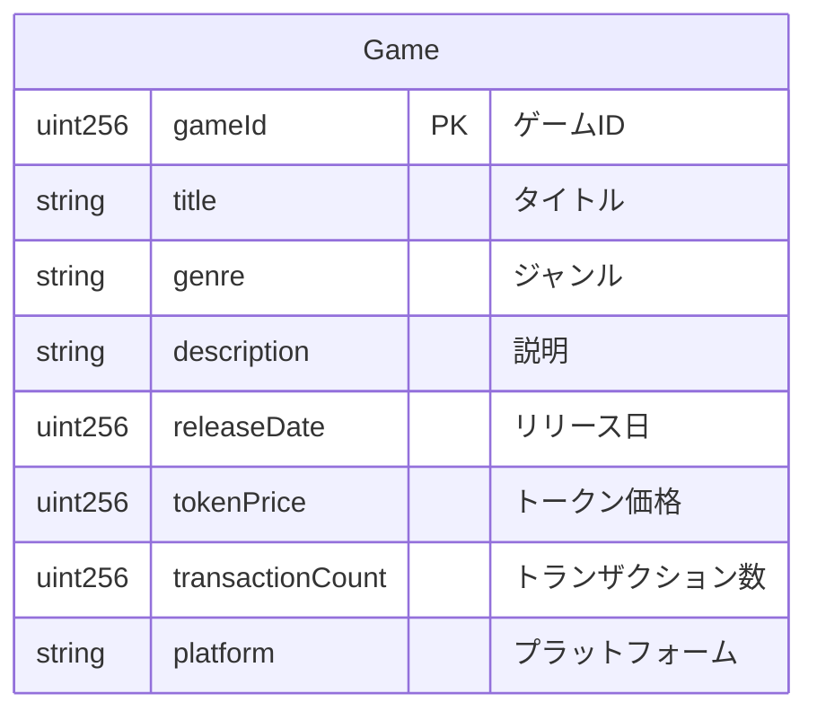

# Solidity-EDCON2024-Workshop

Solidity-EDCON2024-Workshop

## キーワード

- AI TDD(AI テスト駆動開発)

## ポイント

- AI にコードを生成させる時にアウトプットの質が下がらないようにするために毎回自動テストを実行させる。
- コントラクトで取り扱うデータの型をまとめたスキーマ用のファイルを作る。
- Solidity では基本的にデプロイ後にロジックを変えることは困難。
- スマートコントラクトの実装例は既存技術に比べて出回っているドキュメントやサンプルコードは少ない。
- Rust と同じように実装ファイルにテストがかけるのでそれを上手に使うことが必要。
- 複雑なプロンプトを渡すと出力がデグレする可能性がある。

## 流れ

- ユーザー(ペルソナ)像の設定
- 関数の列挙
- ER 図の定義
- データ型の定義
- フローチャートを生成させる
- ステートマシン(モード)の作成

⇨ 誰の何のためのシステムなのか？
⇨ そこから必要な関数やデータはどんなものか？
⇨ 最後にステートマシンを作る。

⇨ ユーザーやスポットなどの変化の状態を列挙してプロンプトとして渡してあげることが重要。

## サンプル プロンプト

```txt
私たちのプロトコルのユーザーペルソナを設定したいので、質問してください。１問ずつの簡潔なインタラクションを好みます。
```

```txt
私たちのプロトコルの最も典型的なユーザーは誰ですか？例えば、開発者、投資家、日常ユーザーなどです。
```

```txt
最近の東京はとても暑いので、涼める場所を教えてくれる人が、すずみたい人のために地図を作っていく分散プロトコルを作りたいです
```

```txt
このプロトコルにおけるユーザーのペルソナは、涼める場所を探している一般の市民と、それらの場所を推薦する情報提供者の2つのグループに分けられます。それでは、まず「涼める場所を探している一般の市民」のペルソナについて質問します：
```

```txt
この市民はどのような特徴を持っていますか？例えば、年齢層、テクノロジーリテラシー、主な活動時間帯などを教えてください。
```

```txt
なんらかの理由で東京に来ていて、地上を歩いていて、スマートフォンを持っていて、場合によっては老人や新生児など、ハイリスクなユーザーもいます。ですから、緊急度の高いユーザーと普通に暑いユーザーとがいます。
```

```txt
素晴らしいです。この情報を元に、ユーザーペルソナを以下のように設定します。
```

```txt
涼める場所を探している一般の市民
来訪者: なんらかの理由で東京に来ている
活動状況: 地上を歩いている
デバイス: スマートフォンを所持している
リスク分類:
緊急度の高いユーザー: 高齢者、新生児を連れた親、その他の健康リスクがある人
普通の暑いユーザー: 健康で暑さから一時的に涼みたい一般の人々
次に、「情報提供者」のペルソナについて質問します。このプロトコルで涼める場所の情報を提供する人はどのような特徴を持っていますか？例えば、地元の住民、観光ガイド、店舗経営者などです。
```

```txt
情報提供者はそのまちを頻繁に訪れる人間で、他者に迷惑をかけずに涼める場所とそのキャパシティなどの知識を持っている人です。なるべく他者やその場所の持ち主に迷惑がかからないような情報を提供すべきアクターです。
```

```txt
ありがとうございます。次に、情報提供者のペルソナを以下のように設定します。
```

```txt
涼める場所を提供する情報提供者
来訪頻度: その町を頻繁に訪れる
知識: 他者に迷惑をかけずに涼める場所とそのキャパシティに関する知識を持っている
責任感: 他者やその場所の持ち主に迷惑がかからないような情報を提供する
```

```txt
それでは、次のステップに進み、プロトコルにおける最初の関数の名前とその引数を考えましょう。最初の関数として、ゲームの情報を登録するための関数を考えます。この関数の名前と必要な引数を教えてください。
```

## ワークショップでトライした記録

```txt
これからSolidityというプログラミング言語を使ってスマートコントラクトを開発したいです。
スマートコントラクトにはアプリのロジックを実装することになりますが、まずユーザー像を明確化させたいです。

ユーザーペルソナを設定したいので、質問してください。
１問ずつの簡潔なインタラクションを好みます。

10回繰り替えたらそれまでのやりとりを振り返って、ペルソナ像を簡潔な日本語でまとめて出力してください。
よろしくお願いします。
```

```bash
ユーザーペルソナ：

目的: ブロックチェーンゲームをプレイしてトークンを獲得する。
重要視するポイント: ゲームのジャンル。
プレイ時間帯: 主に夜。
予算: ライトユーザーは月に数千円から数万円。
デバイス: スマートフォン。
重視する要素: ゲームの面白さ。
求めるサポート: チュートリアル。
価値がある報酬: トークンを獲得し、アイテムと交換すること。
情報取得方法: メール。
レビュー・評価の重視点: トランザクション数とトークンの価格。
交流手段: チャット。
```

```txt
それでは、次のステップに進み、プロトコルにおける最初の関数の名前とその引数を考えましょう。最初の関数として、ゲームの情報を登録するための関数を考えます。この関数の名前と必要な引数を教えてください。
```

```bash
関数名
registerGame

引数
gameId: uint256
ゲームを識別するためのユニークなID。
title: string
ゲームのタイトル。
genre: string
ゲームのジャンル（例：アクション、RPGなど）。
description: string
ゲームの詳細な説明。
releaseDate: uint256
ゲームのリリース日（UNIXタイムスタンプ形式）。
tokenPrice: uint256
ゲーム内で使用されるトークンの価格。
transactionCount: uint256
ゲーム内でのトランザクション数。
platform: string
ゲームがプレイできるプラットフォーム（例：iOS、Android、PCなど）。
```

```txt
次に、ER図をMermaidコードで作成するために、スキーマとエンティティの関係を定義します。それについて進めていきましょうか？

進めてみてください
```



```txt
次に、Schema.solファイルのコードを生成します。Schema.solは構造体の定義のみを含みます。これに進んでよろしいですか？

お願いします
```

```sol
// SPDX-License-Identifier: MIT
pragma solidity ^0.8.0;

contract Schema {
    struct Game {
        uint256 gameId;         // ゲームID
        string title;           // タイトル
        string genre;           // ジャンル
        string description;     // 説明
        uint256 releaseDate;    // リリース日
        uint256 tokenPrice;     // トークン価格
        uint256 transactionCount; // トランザクション数
        string platform;        // プラットフォーム
    }
}
```

```txt
次に、これらの状態遷移図を元に各関数のフローチャートを作成し、それをMermaidコードで表現しますか？

各関数のフローチャートを作って、関数を生成してください
```

### 参考文献

1. [Workshop: Solidity with LLM](https://speakerdeck.com/shogochiai/workshop-solidity-with-llm)
2. [Solidity AI - MC GPT](https://chatgpt.com/g/g-LpVtGHVKn-solidity-ai-mc-gpt)
